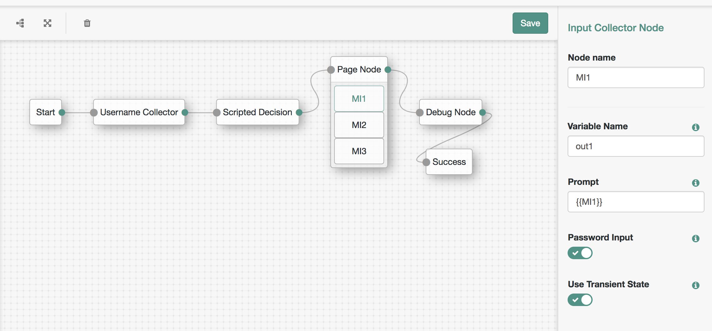

<!--
 * The contents of this file are subject to the terms of the Common Development and
 * Distribution License (the License). You may not use this file except in compliance with the
 * License.
 *
 * You can obtain a copy of the License at legal/CDDLv1.0.txt. See the License for the
 * specific language governing permission and limitations under the License.
 *
 * When distributing Covered Software, include this CDDL Header Notice in each file and include
 * the License file at legal/CDDLv1.0.txt. If applicable, add the following below the CDDL
 * Header, with the fields enclosed by brackets [] replaced by your own identifying
 * information: "Portions copyright [year] [name of copyright owner]".
 *
 * Copyright 2017 ForgeRock AS.
-->
<b>Input Collector Authentication Node</b>
 
A simple authentication node that collects a user input and stores result in shared or transient state. A more generic version of the username and password collector nodes.
 
 
<b>Installation</b>
 
Copy the .jar file from the ../target directory into the ../web-container/webapps/openam/WEB-INF/lib directory where AM is deployed.  Restart the web container to pick up the new node.  The node will then appear in the authentication trees components palette.
 
 
<b>Usage</b>
 
Deploy the node and set appropriate config values where:
 
- Variable Name: name of the shared state or transient shared state object to store the users input.
 
- Prompt: user prompt to display. Can be either a static value or a shared state variable enclosed in double braces, e.g., {{prompt}}
 
- Password: set to true to use a Password callback which normally causes user input to be hidden when typed.
 
- Use Transient State: set to true to store password values in transient state.
 
 
Note: this replaces a previous version of the Input Collector Node which allowed multiple inputs to be collected. It's recommended instead to use this node in combination with a Page Node to achieve the same result.
 
 
<b>To Build</b>
 
Edit the necessary InputCollectorNode.java as appropriate.  To rebuild, run "mvn clean install" in the directory containing the pom.xml
 
 
 

 
<b>Disclaimer</b>
The sample code described herein is provided on an "as is" basis, without warranty of any kind, to the fullest extent permitted by law. ForgeRock does not warrant or guarantee the individual success developers may have in implementing the sample code on their development platforms or in production configurations.

ForgeRock does not warrant, guarantee or make any representations regarding the use, results of use, accuracy, timeliness or completeness of any data or information relating to the sample code. ForgeRock disclaims all warranties, expressed or implied, and in particular, disclaims all warranties of merchantability, and warranties related to the code, or any service or software related thereto.

ForgeRock shall not be liable for any direct, indirect or consequential damages or costs of any type arising out of any action taken by you or others related to the sample code.